

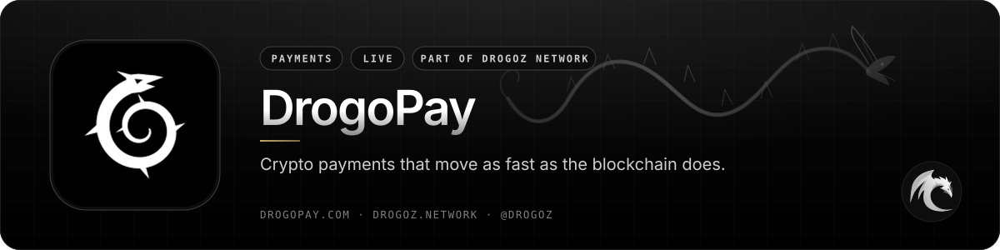

 

# DrogoPay

### Crypto payments that move as fast as the blockchain does.

 

 

## 📋 Table of contents

- [Overview](#-overview)
- [Key features](#-key-features)
- [Screenshots](#-screenshots)
- [How it works](#%EF%B8%8F-how-it-works)
- [Supported assets](#-supported-assets)
- [Use cases](#-use-cases)
- [Integrate](#-integrate)
- [Pricing](#-pricing)
- [Free live demonstration](#-free-live-demonstration)
- [Links](#-links)

## 🧭 Overview

**DrogoPay** is real-time crypto payment infrastructure. A business takes a price in dollars, DrogoPay opens a hosted checkout, watches the chain, and confirms the moment the transfer is final — including the messy payments that other checkouts silently lose.

A merchant creates a payment by hand, with a shareable link, or from their own software through the API. The payer opens the link, chooses a coin, and gets a **unique receiving address**, the exact amount and a QR code their wallet can pre-fill. DrogoPay reports each stage live — *detected → confirming → confirmed* — credits the merchant when the transfer is final, and tells the merchant's systems by signed webhook. The merchant withdraws to its own wallet whenever it likes.

The idea that explains every screen: **every address belongs to exactly one payment.** That is why a wrong amount is still recognised, why nothing is discarded, and why the checkout can tell a payer precisely what happened. A customer can never mark their own payment successful — only the network can, or (in an outage) a platform operator with a recorded reason.

Live at [drogopay.com](https://drogopay.com/). Product guide: [drogopay.com/guide](https://drogopay.com/guide). API reference: [drogopay.com/developers](https://drogopay.com/developers).

<table>
<tr>
<td align="center" width="25%"><b>Category</b> Payments</td>
<td align="center" width="25%"><b>Status</b> Live</td>
<td align="center" width="25%"><b>Website</b> <a href="https://drogopay.com/">drogopay.com</a></td>
<td align="center" width="25%"><b>Pricing</b> Shown in-product · demo on request</td>
</tr>
</table>

## ✨ Key features

### ⚡ Hosted checkout that updates itself

- **A unique address per payment** — never reused. The payment is identified by the address it was sent to, then the amount is classified.
- **Wallet-ready QR codes** — the checkout encodes a payment URI so a wallet pre-fills asset and amount. Address-only mode and a universal-link fallback are available.
- **Live statuses the payer can understand** — *Awaiting → Detected → Confirming → Confirmed*, plus clear notes when the amount differs or the window expires.
- **A payment window, not an infinite invoice** — 5 to 120 minutes, set per payment, per link or as a merchant default. The countdown is anchored to server time. When it hits zero with nothing received, the page states plainly that this address can no longer be paid.
- **Switch coin before anything is sent** — the old address is released and the payer is back at the picker.
- **PDF receipts** — amount, asset, network, addresses, on-chain transactions with explorer links, timestamps and status. The payer, the merchant and the operator each get the copy that belongs to them. Nothing is issued before funds arrive.
- **Live support on the checkout** — an operator who opens the chat already sees the payment. Staff will never ask for a seed phrase, private key or wallet password.

### 🔗 Payment links — no code required

- **Single-use links** for invoices and orders: once confirmed, the link is marked paid and cannot be reused.
- **Reusable links** for donations, tips or a fixed-price product page.
- **Fixed USD amount**, or an open amount with optional minimum and maximum.
- **Leave the coin open** so the payer picks from everything the merchant can receive, or lock one asset and network.
- **Success and cancel URLs**, optional email / note collection, expiry and max uses.
- A short public URL (`drogopay.com/<digits>`) and a QR code for every link. Disable a link at any time.

### 🧭 Honest handling of the messy payments

Most crypto checkouts match an exact amount, so a customer who sends $1,001 instead of $1,000 becomes a lost transaction and a support ticket. DrogoPay classifies the difference and keeps both sides informed:

| What happened | What DrogoPay does |
|---|---|
| Exact amount | Confirms and settles automatically |
| Short, within the merchant's tolerance | Settles automatically |
| Short, beyond tolerance | Marked underpaid; session stays open so the remainder can land on the same address |
| Paid in two (or more) transactions | Every transfer attaches to one payment; it completes when the total clears |
| Overpaid | Full amount recorded, excess tracked separately |
| Paid after the window closed | Still attributed, flagged for review |
| Arrived at an owned address with no matching payment | Lands in the unmatched queue with a confidence score — never discarded |
| Confirmed transaction dropped by a reorg | Un-counted, payment flagged, operators alerted |

The merchant chooses the **mismatch policy** in advance: *strict*, *tolerant* (confirm within a set percentage) or *manual*. Whatever they choose, the payer's page shows exactly what arrived and what is missing or extra.

### 🏪 Merchant workspace

- **Overview** — last 24 hours, settled volume, success rate, balances per asset, revenue by service, and a live feed of detections, confirmations and withdrawals. Numbers update over a realtime connection; nobody has to refresh.
- **Services** — several storefronts on one account. A name, a slug, an optional website. Payments, links and API keys can be attributed to a service so revenue is reported per line.
- **Payments** — every payment, live. Filter by status, asset, service, date or reference. Open one for the address, every on-chain transaction, the timeline and the actions that still make sense. Export any filtered list as CSV.
- **Balances & withdrawals** — balances are per asset and per network. Destinations are whitelisted with a cooling-off period. The network fee is shown before confirm. Sensitive actions ask for the password and 2FA again.
- **Team & security** — owner, staff roles, two-factor authentication, session list, trusted devices, sign-in alerts. Support will never ask for a password, 2FA code or API secret.
- **In-dashboard support** — write to DrogoPay from the workspace. Merchants also see, read-only, the conversations their payers opened from checkout.

### 👨‍💻 API, webhooks and realtime

- **Two ways in, one checkout.** Create a payment link when the payer should pick the coin; create a payment directly when the coin is already chosen. Or skip code entirely and use the dashboard.
- **Signed requests** — every call is authenticated and protected against replay. Secrets are shown once, scoped, optionally bound to a service and to IP ranges, and revocable instantly.
- **Signed webhooks** with retries and a full delivery history. Act on confirmation; decide your own policy for underpaid / overpaid; make handlers idempotent on the payment id.
- **Realtime feed** for your own status pages — subscribe to a payment and receive each state change as it happens. After a reconnect the client can resume from the last event it actually saw.
- **Live documentation** at [drogopay.com/developers](https://drogopay.com/developers) — OpenAPI, examples in curl / Node.js / Python, and the same reference inside the dashboard with the merchant's own key id filled in.

### 🔐 Security that belongs on a payments product

- **Private keys never reach a browser — or the application server.** Withdrawal signing happens in an isolated high-security component. The frontend can only ever ask for a withdrawal.
- **Single-use receiving addresses**, so a payment can be recognised even when the amount is wrong and cannot be confused with another.
- **Step-up authentication** for anything that moves money or changes destinations.
- **Append-only audit** of administrative actions with actor, reason, IP and time. Nobody can edit it.
- **Two-factor is mandatory for platform operators** and strongly recommended for merchants.
- **Dollar amounts are indicative.** DrogoPay does not hold or convert fiat. It is payment software, not a bank or an exchange.

### 🖥️ Operations command center

Operators get a live command center rather than a report: volume, revenue, balances and network fees on one side; auto-prioritised queues of everything that is stuck, mismatched, unmatched or suspicious on the other. Payments, links, withdrawals, merchants and support sit in one inbox — payers, merchants and guests labelled as such. The operations panel is not on a public URL.

## 🖼️ Screenshots

> Official key visual and live screenshots from [drogopay.com](https://drogopay.com/) — the public site, the product guide, the developer documentation and the merchant sign-in.

<table>
<tr>
<td width="50%" align="center">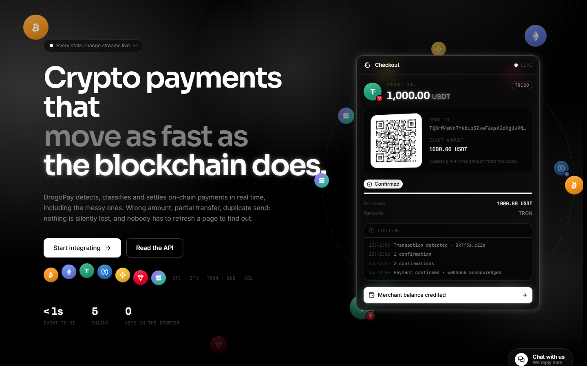 drogopay.com — hosted checkout preview: unique address, QR, live confirmations</td>
<td width="50%" align="center">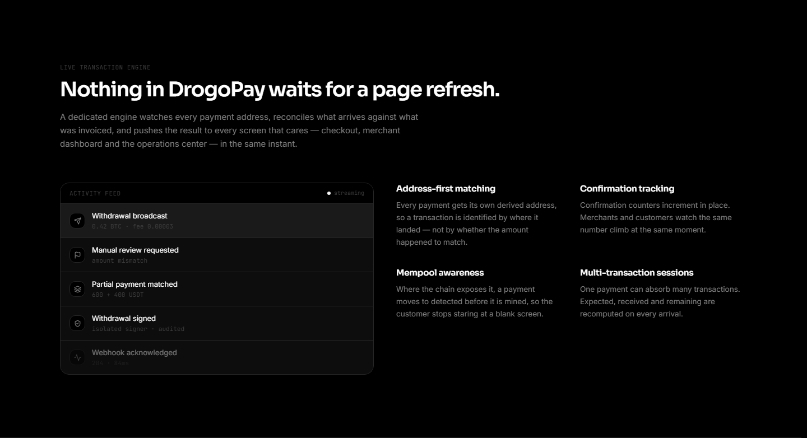 Nothing waits for refresh — every state change streams live</td>
</tr>
<tr>
<td width="50%" align="center">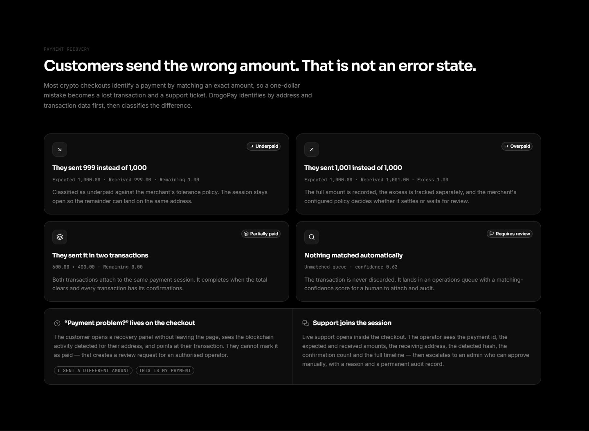 Wrong amount is not an error state — underpaid, overpaid, split and unmatched</td>
<td width="50%" align="center">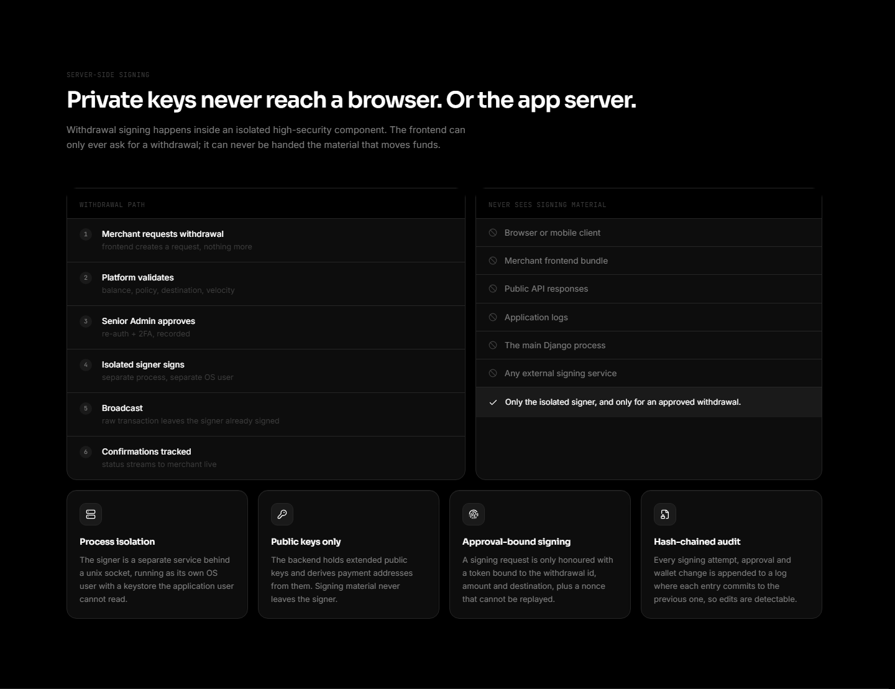 Private keys never reach a browser. Or the app server.</td>
</tr>
<tr>
<td width="50%" align="center">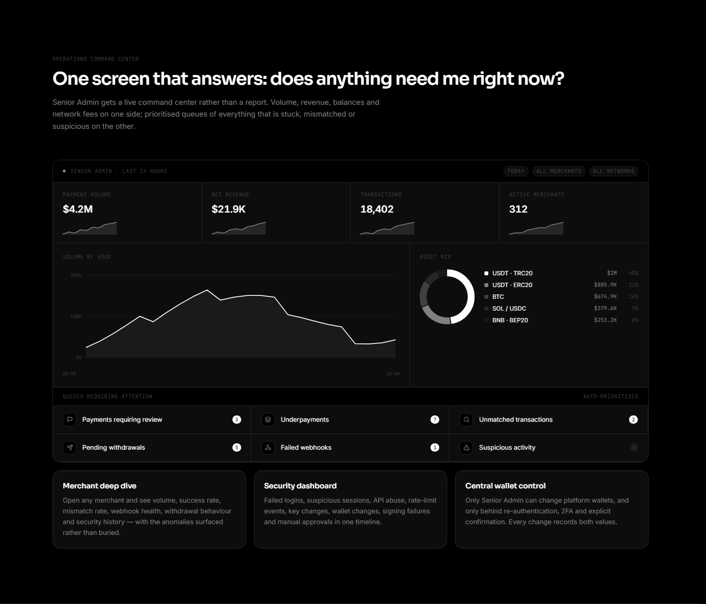 One screen that answers: does anything need me right now?</td>
<td width="50%" align="center">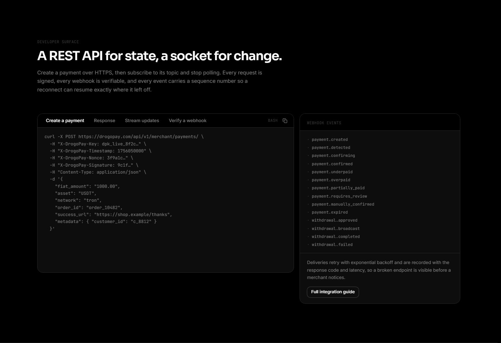 A REST API for state, a socket for change</td>
</tr>
<tr>
<td width="50%" align="center">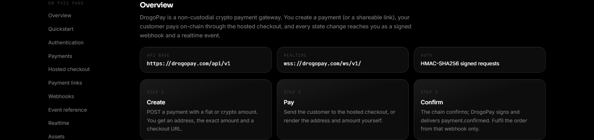 Developer documentation — quickstart, API, webhooks and realtime</td>
<td width="50%" align="center">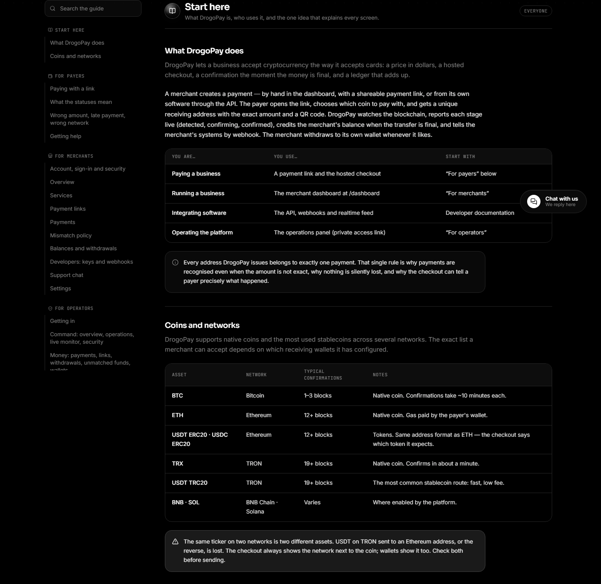 Product guide — 26 topics, screen by screen, for everyone who touches it</td>
</tr>
<tr>
<td width="50%" align="center">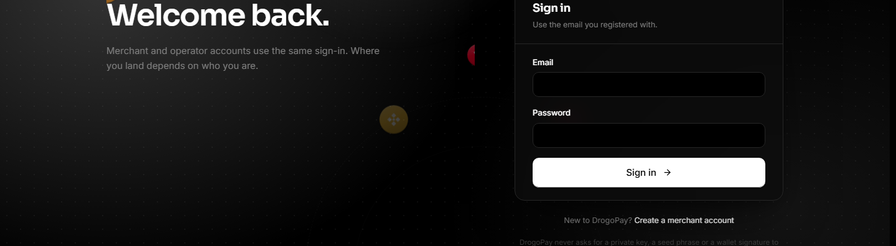 Welcome back — merchant and operator accounts use the same sign-in</td>
<td width="50%" align="center">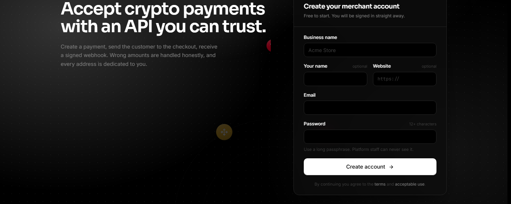 Create a merchant account — dedicated addresses, signed keys, signed webhooks, hosted checkout</td>
</tr>
</table>

## ⚙️ How it works

**From a dollar price to a confirmed payment — without losing the messy ones**

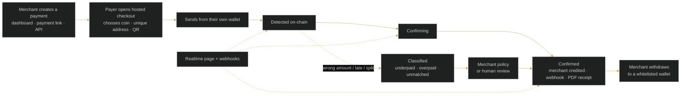

## 🪙 Supported assets

The exact list a merchant can accept depends on which receiving wallets are configured. Typical routes:

| Asset | Network | Notes |
|---|---|---|
| **BTC** | Bitcoin | Native coin |
| **ETH** | Ethereum | Native coin |
| **USDT · USDC** | Ethereum (ERC-20) | Same address format as ETH — the checkout says which token it expects |
| **TRX** | TRON | Native coin, fast confirmations |
| **USDT** | TRON (TRC-20) | The most common stablecoin route: fast, low fee |
| **BNB · SOL** | BNB Chain · Solana | Where enabled on the platform |

> The same ticker on two networks is two different assets. USDT on TRON sent to an Ethereum address is not recoverable by DrogoPay. The checkout always shows the network next to the coin.

## 🎯 Use cases

<table>
<tr>
<td width="50%" valign="top"><b>🛒 Online stores &amp; invoices</b> Create a single-use link or a payment from your backend, send the customer to checkout, fulfil on <code>payment.confirmed</code>.</td>
<td width="50%" valign="top"><b>🧩 SaaS &amp; digital products</b> Reusable or one-shot links, success/cancel URLs, reference and metadata returned on every webhook.</td>
</tr>
<tr>
<td width="50%" valign="top"><b>🌍 Cross-border businesses</b> Take USDT, BTC, ETH and more without holding fiat. The merchant withdraws to a wallet they control.</td>
<td width="50%" valign="top"><b>🛟 Support-heavy checkouts</b> Wrong amounts, late sends and split transfers stay on the same payment. Live chat is already attached to the session.</td>
</tr>
<tr>
<td width="50%" valign="top"><b>👩‍💻 Product teams integrating once</b> Signed API, signed webhooks, a hosted checkout you do not have to design, and a realtime feed for your own status page.</td>
<td width="50%" valign="top"><b>🏦 Finance &amp; operations</b> Per-asset balances, CSV exports, PDF receipts, a whitelist on withdrawals, and an audit trail on anything a human decided.</td>
</tr>
</table>

## 🔌 Integrate

Three ways to get paid. All of them end at the same hosted checkout and the same ledger.

| Approach | Best for | What you do |
|---|---|---|
| **No code** | Small shops, donations, invoices | Create a payment link in the dashboard. Share the short URL or QR. Watch the workspace update live. |
| **Payment links via API** | Orders where the payer should pick the coin | Create a link with the dollar amount, your order reference and success/cancel URLs. Send the customer to the returned URL. Listen for payment webhooks carrying your reference. |
| **Direct payments via API** | You already know the coin | Create a payment with asset, network and amount. Show the returned checkout URL, or render the address in your own UI. |

Go-live, in plain language:

1. Create a merchant account at [drogopay.com/signup](https://drogopay.com/signup) and turn on two-factor authentication.
2. Create an API key under **Developers** with only the scopes you need. Store the secret on a server, never in a browser or a repository.
3. Register a webhook endpoint and verify the signature on every delivery. Respond quickly; deliveries retry with backoff.
4. Create one payment (or one link) per order, with **your** reference on it.
5. Fulfil only when the payment is confirmed. Decide your mismatch policy before the first live customer.
6. Withdraw to a destination you added in advance.

The complete reference — authentication, every public endpoint, webhook payloads, event types, error codes, realtime frames and a go-live checklist — is generated from the live API at **[drogopay.com/developers](https://drogopay.com/developers)**.

## 💳 Pricing

> **A live demonstration is free.** Merchant signup is open at [drogopay.com/signup](https://drogopay.com/signup). Platform fees and your take rate are shown **inside the product** before you take the first live payment. For a tailored offer, a walkthrough or volume pricing — [ask @drogoz on Telegram](https://t.me/drogoz) or write to [hello@drogoz.network](mailto:hello@drogoz.network).

## 🎥 Free live demonstration

**A live demonstration is 100% free on every product.** 
See DrogoPay in action before you pay — our agent gets in touch and walks you through a live demonstration: checkout, a wrong-amount recovery, the merchant workspace and the API.

Registration is handled by our team if you want a guided start — or open [drogopay.com/signup](https://drogopay.com/signup) yourself.

## 🔗 Links

| Channel | Link |
|---|---|
| 🌐 **Website** | [drogopay.com](https://drogopay.com/) |
| 📘 **Product guide** | [drogopay.com/guide](https://drogopay.com/guide) |
| 💻 **Developer docs** | [drogopay.com/developers](https://drogopay.com/developers) |
| 🔐 **Sign in** | [drogopay.com/login](https://drogopay.com/login) |
| ✈️ **Telegram** | [@drogoz](https://t.me/drogoz) |
| 🏛️ **Drogoz Network** | [drogoz.network](https://drogoz.network) · [Services](https://drogoz.network/#services) · [Packages](https://drogoz.network/#packages) · [Pricing](https://drogoz.network/pricing/) · [Presentation](https://drogoz.network/presentation/) |
| ⚖️ **Legal** | [Terms](https://drogopay.com/legal/terms) · [Acceptable Use](https://drogopay.com/legal/acceptable-use) · [Privacy](https://drogopay.com/legal/privacy) · [Refunds](https://drogopay.com/legal/refunds) · [Disclaimer](https://drogopay.com/legal/disclaimer) · [Compliance](https://drogopay.com/legal/compliance) |
| 🔒 **Source code** | Private repository — this public repo documents the product only |
| 🐙 **GitHub** | [deepdrogo](https://github.com/deepdrogo/deepdrogo) |

 

   
  
    
  <b>Made by <a href="https://drogoz.network">Drogoz Network</a></b> 
  One network — all your services · Premium SaaS Network
    
  
  
  
  
    
  <b>More from the network:</b> <a href="https://github.com/deepdrogo/hashgram">Hashgram One</a> · <a href="https://github.com/deepdrogo/drog-ai">Drog AI</a> · <a href="https://github.com/deepdrogo/mymask-ai">MyMask AI</a> · <a href="https://github.com/deepdrogo/replika">Replika</a> · <a href="https://github.com/deepdrogo/lidaro-ai">Lidaro AI</a> · <a href="https://github.com/deepdrogo/imperatori">IMPERATORI</a> · <a href="https://github.com/deepdrogo/zoi-talks">ZOI Talks</a> · <a href="https://github.com/deepdrogo/riderswap-io">RiderSwap</a> · <a href="https://github.com/deepdrogo/hyperblast-ai">HyperBlast AI</a> · <a href="https://github.com/deepdrogo/verifhub-ai">VerifHub AI</a> · <a href="https://github.com/deepdrogo/vadira-net">Vadira</a> · <a href="https://github.com/deepdrogo/skriper-io">Skriper</a> · <a href="https://github.com/deepdrogo/mytasker">MyTasker</a> · <a href="https://github.com/deepdrogo/mamont-tech">Mamont</a> · <a href="https://github.com/deepdrogo/drogscan">DrogScan</a>
    
  © 2026 Drogoz Network. All rights reserved. Provided strictly for lawful use — see the <a href="https://drogopay.com/legal/terms">Legal</a> pages. Each user is solely responsible for how they use the software. DrogoPay does not hold or convert fiat and is not a bank or an exchange.

